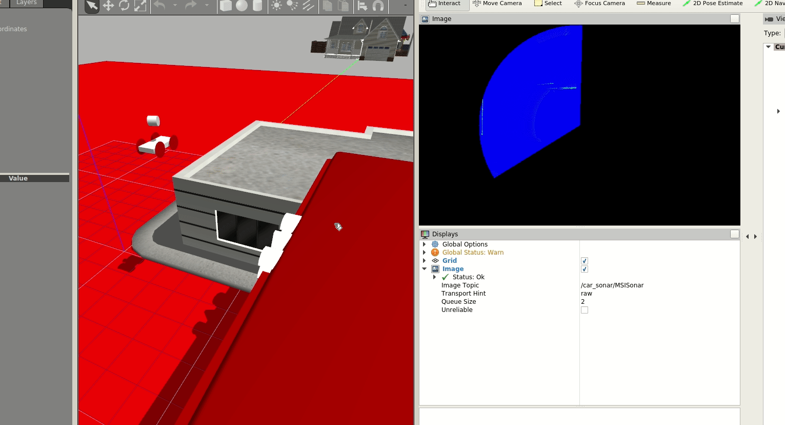

Mechanical scanning imagery sonar for gazebo
=======================================

Sonar based on a the article **[A novel GPU-based sonar simulator for real-time applications](https://www.sciencedirect.com/science/article/pii/S0097849317301371)** ,and if you want a superficial overview or dont have access to science direct [Custom Shader and 3D Rendering for computationally efficient Sonar Simulation](http://sibgrapi.sid.inpe.br/col/sid.inpe.br/sibgrapi/2016/08.09.11.51/doc/sibgrapi16.pdf).

For more information, consult the [documentation](https://github.com/Brazilian-Institute-of-Robotics/mechanical_scanning_imaging_sonar_gazebo/wiki).

ros melodic+gazebo9:
$ cd ~/catkin_ws/src/
$ git clone https://github.com/AIRS-TJ/sonar_msgs.git
$ git clone https://github.com/AIRS-TJ/mechanical_scanning_imaging_sonar_gazebo.git -b melodic
$ cd ..
$ catkin_make
run:
$ roslaunch mechanical_scanning_imaging_sonar_gazebo car_sonar.launch

But, just so you can see how it works:

